# My Full-Stack Journey

Welcome to **My Full-Stack Journey** - A comprehensive learning repository documenting my progress in full-stack web development, covering both frontend and backend technologies.

## 📋 Table of Contents

- [Overview](#overview)
- [Folder Structure](#folder-structure)
- [Backend](#backend)
- [Frontend](#frontend)
- [Getting Started](#getting-started)

---

## Overview

This repository contains a collection of learning materials, code samples, and projects demonstrating knowledge in:

- **Backend Development**: SQL and database management
- **Frontend Development**: HTML, CSS, JavaScript, and Bootstrap
- **Full-Stack Projects**: Complete web applications combining frontend and backend

---

## 📸 Screenshots Gallery

A visual overview of the key pages and UI sections included in this journey:

<div align="center" style="margin-top: 24px; margin-bottom: 24px;">
  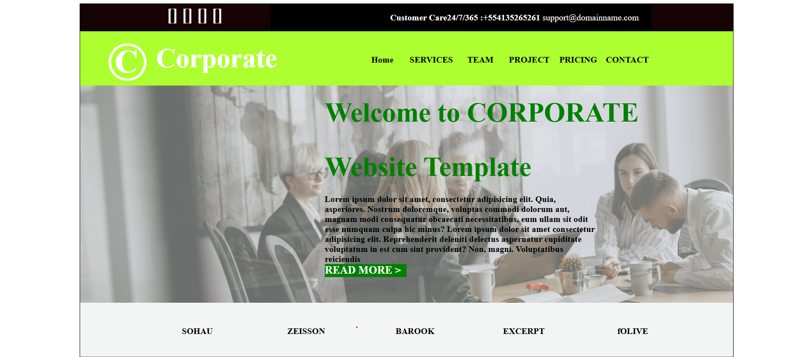
</div>

<div align="center" style="margin-top: 24px; margin-bottom: 24px;">
  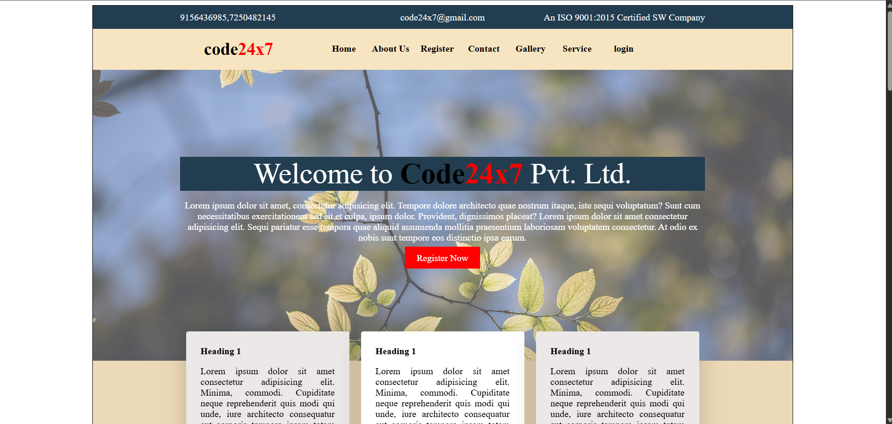
</div>

<div align="center" style="margin-top: 24px; margin-bottom: 24px;">
  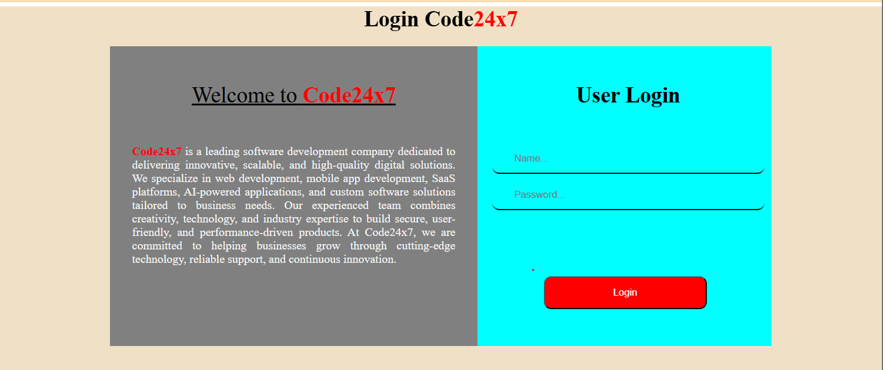
</div>

<div align="center" style="margin-top: 24px; margin-bottom: 24px;">
  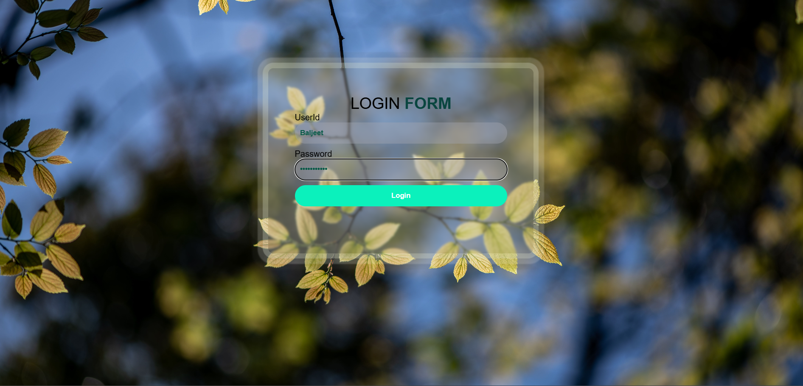
</div>

<div align="center" style="margin-top: 24px; margin-bottom: 24px;">
  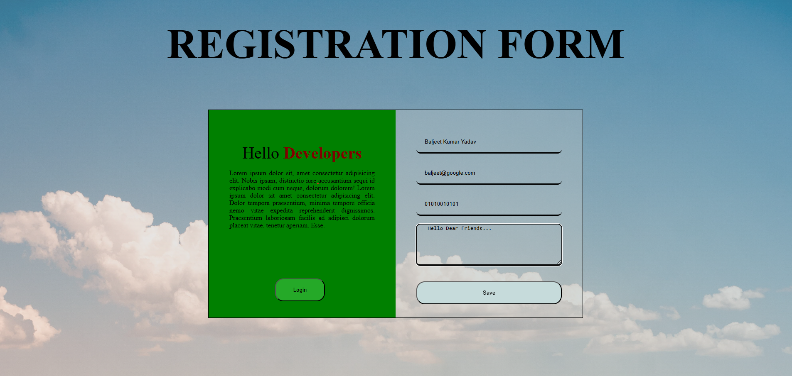
</div>

<div align="center" style="margin-top: 24px; margin-bottom: 24px;">
  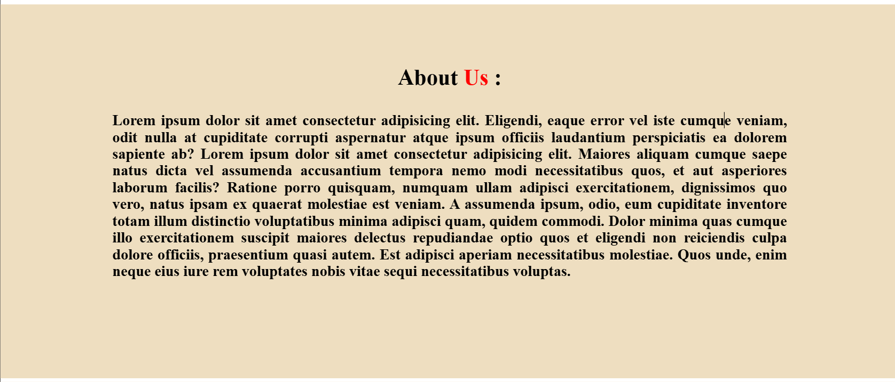
</div>

<div align="center" style="margin-top: 24px; margin-bottom: 24px;">
  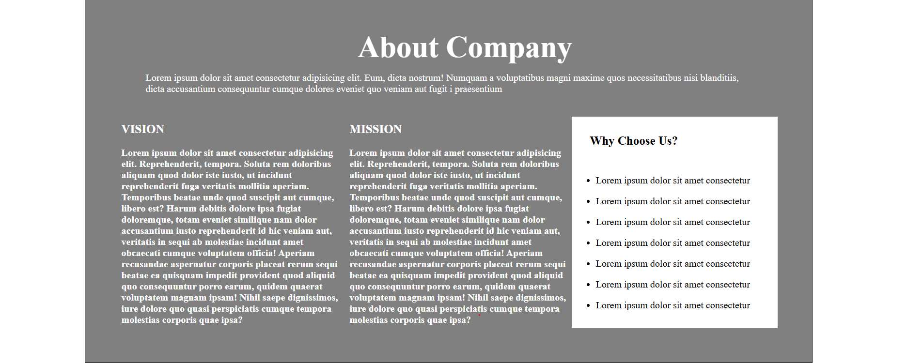
</div>

<div align="center" style="margin-top: 24px; margin-bottom: 24px;">
  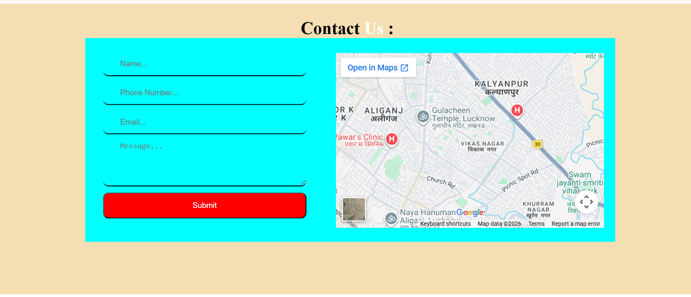
</div>

<div align="center" style="margin-top: 24px; margin-bottom: 24px;">
  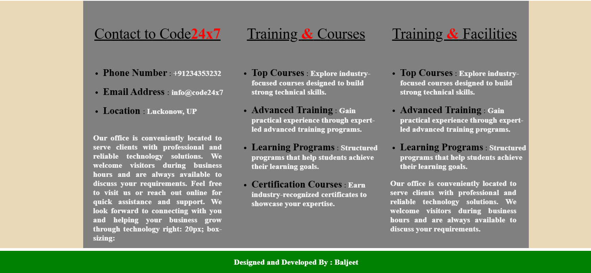
</div>

<div align="center" style="margin-top: 24px; margin-bottom: 24px;">
  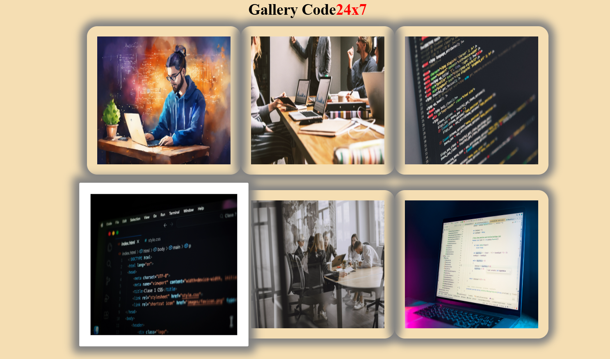
</div>

<div align="center" style="margin-top: 24px; margin-bottom: 24px;">
  
</div>
<div align="center" style="margin-top: 24px; margin-bottom: 24px;">
  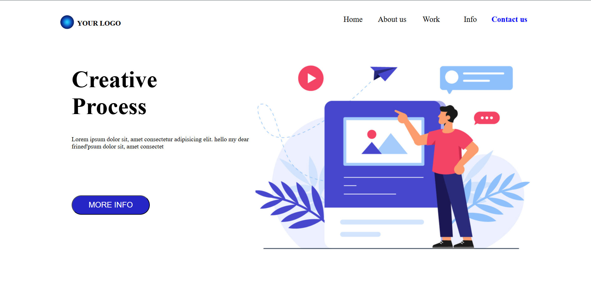
</div>

---

## Folder Structure

```
My-FullStack-Journey/
├── Backend/
│   └── SQL/
├── Frontend/
│   ├── Bootstrap/
│   ├── HTML-CSS/
│   ├── Javascript/
│   └── Projects/
└── README.md
```

---

## Backend

### SQL (`Backend/SQL/`)

This folder contains SQL learning materials and exercises:

- **day1.sql** - Day 1 SQL exercises and basics
- **day2.sql** - Day 2 SQL exercises and intermediate concepts
- **day3.sql** - Day 3 SQL exercises and advanced concepts
- **task1.sql** - SQL task assignment and solutions

**Topics Covered:**

- Database fundamentals
- SQL queries and syntax
- Data manipulation and retrieval
- Database design and management

---

## Frontend

### HTML & CSS (`Frontend/HTML-CSS/`)

Comprehensive HTML and CSS learning materials with 34+ demo files and practical tasks:

**Demo Files:** demo1.html through demo34.html

- Cover fundamental to advanced HTML/CSS concepts
- Responsive design principles
- Layout techniques (Flexbox, Grid)
- Styling best practices

**Practice & Task Files:**

- Practice01.html, Practice02.html - Hands-on practice exercises
- Task01.html through Task13.html - Structured assignments
- notes.txt - Learning notes and reference material
- xyz.css - Custom CSS stylesheet
- images/ - Image assets used in projects

**Resources:**

- Custom CSS file for styling
- Images folder for project assets

---

### JavaScript (`Frontend/Javascript/`)

Interactive JavaScript programming with 30+ demo files and practical exercises:

**Demo Files:** demo1.html through demo31.html

- JavaScript fundamentals and syntax
- DOM manipulation
- Event handling
- Functions and scope
- Objects and arrays
- ES6+ features

**Practice & Task Files:**

- Task1.html through Task7.html - JavaScript tasks
- Calculator.js - Complete calculator implementation
- Calculator_Compressed.js - Minified version
- p1.js - Additional JavaScript module

**Learning Resources:**

- notes.txt - JavaScript concepts and tips
- images/ - Assets for JavaScript projects

---

### Bootstrap (`Frontend/Bootstrap/`)

Bootstrap framework learning and responsive design:

**Main Demo Files:** demo1.html through demo15.html

- Bootstrap grid system
- Bootstrap components (buttons, forms, cards, etc.)
- Responsive layouts
- Bootstrap utilities and helpers

**Login & Authentication:**

- demo8login.html - Login form demo
- Bootstrap_Task8/ - Bootstrap Task 8 section with specialized projects
  - demo8login.html - Authentication interface
  - Task1.html, Task2.html, ... - Specific Bootstrap tasks
  - notes.txt - Task-specific documentation

**Resources:**

- css/ - Custom CSS files
- images/ - Project images
- js/ - JavaScript files for Bootstrap interactivity
- notes.txt - Bootstrap learning notes

---

### Projects (`Frontend/Projects/`)

Complete web projects showcasing full-stack concepts:

1. **CalculatorJS.html** - Interactive JavaScript calculator
2. **CheckPinCode.html** - PIN validation project
3. **ChessWebPage.html** - Chess-themed webpage
4. **LoginForm_UsingBootstrap.html** - Bootstrap-based login form
5. **LoginForm1.html** - Custom HTML/CSS login form (Version 1)
6. **LoginForm2.html** - Custom HTML/CSS login form (Version 2)
7. **NavebarDesign.html** - Responsive navigation bar design
8. **ONOFFBULB.html** - Interactive ON/OFF bulb toggle
9. **RegistrationForm.html** - User registration form
10. **WebPage1.html** - Custom webpage project
11. **WebPage2.html** - Custom webpage project
12. **images/** - Shared images and assets

---

## Getting Started

### Prerequisites

- A modern web browser (Chrome, Firefox, Safari, Edge)
- A code editor (VS Code, Sublime Text, etc.)
- Basic understanding of HTML, CSS, and JavaScript

### Viewing the Files

1. **HTML/CSS/Bootstrap Projects:**
   - Open any `.html` file directly in your browser
   - Right-click → "Open with" → Choose your browser

2. **JavaScript Projects:**
   - Open `.html` files in your browser
   - Open browser Developer Tools (F12) to view console output

3. **SQL Files:**
   - Use any SQL IDE or database client
   - MySQL, PostgreSQL, or SQLite compatible
   - Execute queries from the `.sql` files

### Navigation Tips

- Start with **HTML-CSS** folder for foundational concepts
- Progress to **JavaScript** for interactivity
- Explore **Bootstrap** for responsive design frameworks
- Review **Projects** for complete application examples
- Reference **Backend/SQL** for database concepts

---

## Learning Path Recommendation

```
1. HTML & CSS Basics
   └─→ HTML-CSS/demo1.html through demo15.html

2. Intermediate HTML & CSS
   └─→ HTML-CSS/demo16.html through demo34.html

3. JavaScript Fundamentals
   └─→ Javascript/demo1.html through demo10.html

4. Advanced JavaScript
   └─→ Javascript/demo11.html through demo31.html

5. Bootstrap & Responsive Design
   └─→ Bootstrap/demo1.html through demo15.html

6. Real-World Projects
   └─→ Projects/ folder

7. Database & Backend
   └─→ Backend/SQL/ folder
```

---

## File Organization Tips

Each folder contains:

- **Demo files** - Conceptual demonstrations and examples
- **Task/Practice files** - Hands-on assignments
- **notes.txt** - Learning notes and references
- **Supporting folders** - CSS, JavaScript, images, etc.

---

## Notes

- Some files may have dependencies on local CSS or JavaScript files in the same folder
- Make sure to open HTML files in a browser rather than viewing source code directly for proper rendering
- Explore the browser's Developer Tools to understand how HTML, CSS, and JavaScript interact
- Each demo file is self-contained and can be studied independently

---

## Author : Baljeet Kumar Yadav

This learning repository documents my full-stack development journey, tracking progress from foundational web technologies through advanced project work.

---

**Last Updated:** 2026-06-30

Happy Learning! 🚀
